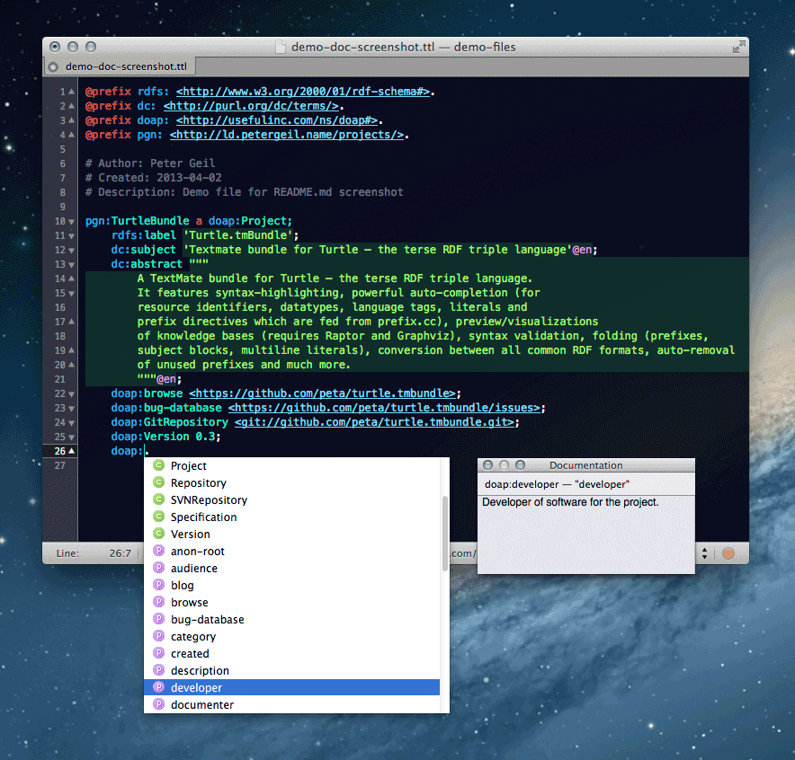
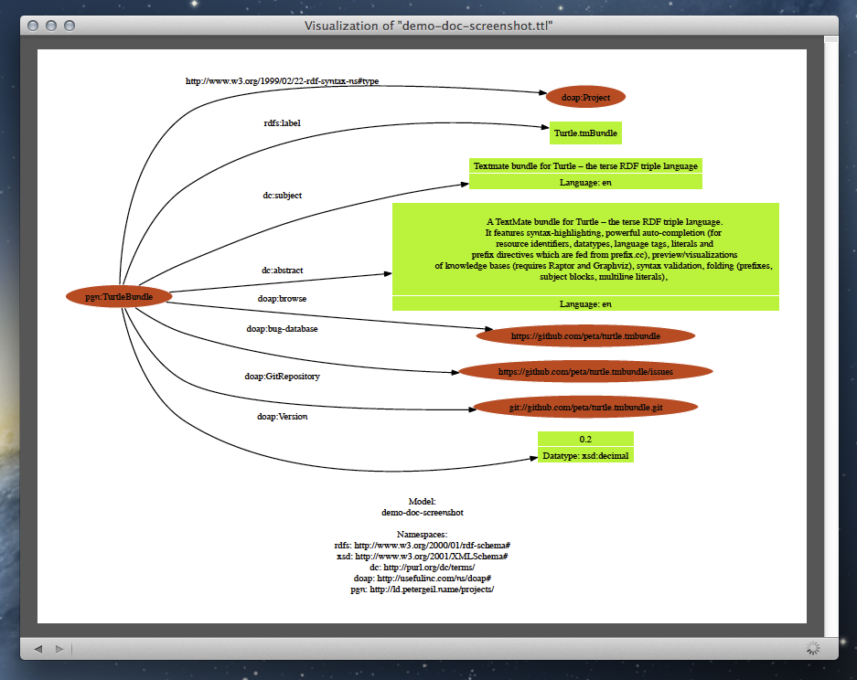

# turtle.tmbundle
---------------------------------------------------------------------

Totally awesome bundle for Turtle – the terse RDF triple language.

It consists of:

+ Language grammar
+ Some snippets (prefixes and document skeleton)
+ Powerful (!) auto-completion (Live-aggregated)
+ Documentation for classes, roles/properties and individuals at your fingertips (Live-aggregated)
+ Commands for instant graph visualization of a knowledge base (requires Graphviz and Raptor)

See [Screenshots](#screenshots)

#### Roadmap

+ Display documentation with links to official sources as HTML in a notification window
+ Polish language grammar
+ Add additional caching layer for speeding up things (vanilla MacOS Ruby 1.8.7 has only sloooow REXML module)
+ To be fixed
	+ Fix PN_LOCAL pattern so that semicolons inside POLs are marked up as terminators
	+ Extractor stylesheet fails at shortening when about attribute contains FQN instead of IRIref

## Language grammar 

The language grammar now covers the official W3C parser spec (as proposed in the latest CR released on Feb 19th 2013). However, there are still one/two particularities that differ, but you shouldn't notice them during your daily work. Should you notice some weird behaviour (results in broken syntax highlighting), please file a bug in the [project's issue tracker](https://github.com/peta/turtle.tmbundle/issues "Here at GitHub").

## Snippets

Right now the following snippets are included:

+ Basic document skeleton
+ "Smart" prefix/base directives (hit tab to see it work)
+ A set of basic prefix directives

## Powerful auto-completion

The Turtle bundle offers auto-completion at two levels:

### Auto-completion when declaring prefixes

When you invoke the `Autocomplete` command (CTRL + SPACE) within the scope of a prefix directive (right after the `@prefix ` keyword), the Turtle bundle fetches a list of all prefixes registered at [prefix.cc](http://prefix.cc) and displays them nicely in a auto-complete dropdown box. Once you have chosen an and confirmed your selection with f.e. `RETURN` the prefix directive is automagically updated with the prefix and its according URI. (Note: the fetched data is locally cached for 24h)

### Auto-completion for prefixed QNames (a.k.a. resource identifiers)

When you invoke the `Autocomplete` command (CTRL + SPACE) within the scope of a prefixed QName (e.g. `my:Dog`), the Turtle bundle determines the actual URI that is abbreviated by the prefix (in this case `my`) and checks if there is a machine readable Vocabulary/Ontology description available (currently only RDF/S and OWL documents in the XML serialization format are supported). When one is found, it is live-aggregated and all of its Classes, Roles/Properties and Individuals are extracted (along with their documentation) and nicely presented in a auto-complete dropdown box. (Note: the fetched data is locally cached for 24h)

__NOTE: *Auto-completion is case-sensitive*__

### Known issues

For now, the Turtle bundle relies on [prefix.cc](http://prefix.cc) for mapping prefixes to URIs (required for all live-aggregations). The problem however is, that the available listings only contain one IRI per prefix (the one with the highest ranking) and not every IRI offers a machine readable vocabulary/ontology representation, what in turn means that for certain prefixes no auto-completion data is available. You can help to fix this, by visiting the according page at prefix.cc (URL scheme looks like `http://prefix.cc/<THE_PREFIX>`; without angle brackets of course) and up/downvoting the according URIs.

## Documentation for classes, roles/properties and individuals

When you invoke the `Documentation for Resource` command (F1) within the scope of a prefixed QName (e.g. `my:Dog`), the Turtle bundle looks up if there are any informal descriptions available (like description texts, HTTP URLs to human-readable docs, asf.) and if so, displays them to the user. (Note: the fetched data is locally cached for 24h)

## Graph visualization

In order to use this functionality you must have a working installation of [Graphviz](http://graphviz.org) (especially the dot command) and the [Raptor RDF syntax library](http://librdf.org/raptor/). When properly installed (locatable through PATHs) everything should work fine ootb. However, in some cases you must explicitly tell Textmate where to find them. You can do this by introducing two configuration variables (Textmate -> Preferences -> Variables):

+ `TM_DOT` absolute path to the dot binary (part of Graphviz)
+ `TM_RAPPER` absoluter path to the rapper binary (part of Raptor)

By hitting `CMD + R` the active TTL document will be visualized on-the-fly in a Textmate HTML preview window. Because these preview windows are driven by Safari's WebKit rendering engine, PDF documents will be rendered right in-line. That way your "edit knowledge base --> visualize" workflow will be super intuitive and wont get interrupted by switching to separate PDF viewer app for viewing the visualization.

By hitting `SHIFT + ALT + CMD + S` the active TTL document will be visualized and saved to a PDF document.

## Installation

The Turtle bundle is now officially available through the Textate bundle installer (Textmate -> Preferences -> Bundles). However, it usually takes a few days until new releases are available through the bundle installer (make sure that you enabled 'Keep bundles updated' in the application preferences). If you know what you do, you can also install bundles (like Turtle) by hand. Just download/clone this repository, and place its root directory at `~/Library/Application Support/Avian/Bundles/Turtle.tmbundle`. That way it's kept distinct from bundles installed through the bundle installer. Textmate should notice the new bundle automatically; but when in doubt, just restart Textmate (`CTRL + CMD + Q`). 

## Screenshots

## Meta

Turtle.tmbundle was created by [Peter Geil](http://github.com/peta). Feedback is highly welcome – if you find a bug, have a feature request or simply want to contribute something, please let me know. Just visit the official GitHub repository at [https://github.com/peta/turtle.tmbundle](https://github.com/peta/turtle.tmbundle) and open an [issue](https://github.com/peta/turtle.tmbundle/issues).
